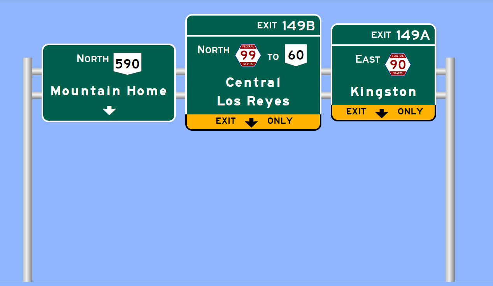

# Samland Sign Maker

A JavaScript-based app for creating highway guide signs.

Allows for the creation of highway guide signs in the style defined by the United States FHWA in their [MUTCD](https://mutcd.fhwa.dot.gov/kno_2009r1r2.htm).

## Modifications have been made for use in Samland

- Image exporting. (From JKPotato-Computer's SignMaker)
- Panels have an ID. (From JKPotato-Computer's SignMaker)

## Acknowledgements

- Typefaces sourced from the [Roadgeek 2005 Font Family by Michael Adams](https://n1en.org/roadgeek-fonts/).
- Route shields are sourced from [Wikipedia](https://en.wikipedia.org/wiki/Numbered_highways_in_the_United_States) and [the OGF wiki](https://wiki.opengeofiction.net/index.php/Category:Highway_shields).
- Based off [OGF-SignMaker](https://github.com/infinatious/OGF-SignMaker) which is based off [Kurumi's Sign Maker](http://www.kurumi.com/roads/signmaker), and forked from [dki-os](https://github.com/dki-os/SignMaker), but uses the image export code from [JKPotato-Computer's SignMaker](https://github.com/JKPotato-Computer/SignMaker/).

## License

[GNU General Public License v3.0](https://www.gnu.org/licenses/gpl-3.0.txt)
